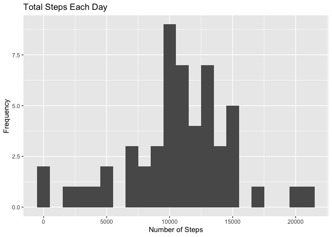
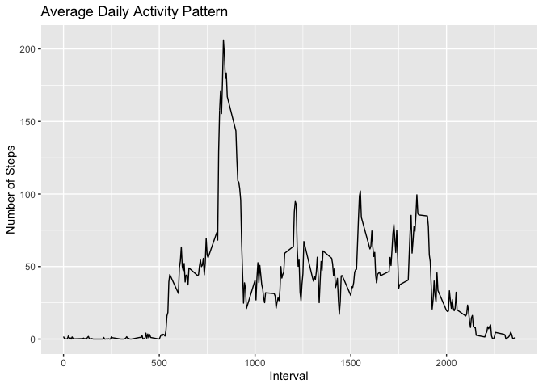
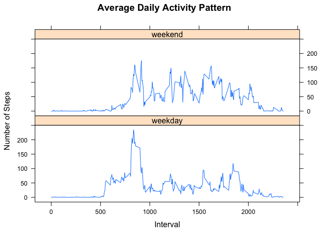

## Introduction

It is now possible to collect a large amount of data about personal movement using activity monitoring devices such as a Fitbit, Nike Fuelband, or Jawbone Up. These type of devices are part of the “quantified self” movement – a group of enthusiasts who take measurements about themselves regularly to improve their health, to find patterns in their behavior, or because they are tech geeks. But these data remain under-utilized both because the raw data are hard to obtain and there is a lack of statistical methods and software for processing and interpreting the data.  

This assignment makes use of data from a personal activity monitoring device. This device collects data at 5 minute intervals through out the day. The data consists of two months of data from an anonymous individual collected during the months of October and November, 2012 and include the number of steps taken in 5 minute intervals each day.  

## Data

The data for this assignment can be downloaded from the course web site: [Activity monitor data[52K]](http://d396qusza40orc.cloudfront.net/repdata%2Fdata%2Factivity.zip)

The variables included in this dataset are:

-steps: Number of steps taking in a 5-minute interval (missing values are coded as NA)  
-date: The date on which the measurement was taken in YYYY-MM-DD format  
-interval: Identifier for the 5-minute interval in which measurement was taken  

The dataset is stored in a comma-separated-value (CSV) file and there are a total of 17,568 observations in this dataset.

## Analysis


```r
setwd("~/Desktop/Exercises/Course5/RepData_PeerAssessment1")
library(tidyverse)
library(lubridate)
library(ggplot2)
library(lattice)
```
### Loading and preprocessing the data

```r
# Load data
if (!file.exists("activity.csv") )
    {
     url <- 'http://d396qusza40orc.cloudfront.net/repdata%2Fdata%2Factivity.zip'  
     download.file(url,destfile='repdata%2Fdata%2Factivity.zip',mode='wb')  
     unzip('repdata%2Fdata%2Factivity.zip')
    }
data <- read.csv("activity.csv") 
```
### What is mean total number of steps taken per day?

```r
# What is mean total number of steps taken per day?
steps_day<-aggregate(steps~date, data, sum)
ggplot(steps_day, aes(x=steps))+
    geom_histogram(binwidth = 1000)+
    labs(x="Number of Steps", y="Frequency")+
    ggtitle("Total Steps Each Day")
```

<!-- -->

```r
steps_day_mean<-mean(steps_day$steps, na.rm=TRUE)
steps_day_median<-median(steps_day$steps, na.rm=TRUE)
```
The mean of total number of steps taken per day is 1.0766189\times 10^{4} and the median of total number of steps taken per day is 10765.

### What is the average daily activity pattern?

```r
# What is the average daily activity pattern?
steps_interval<-aggregate(steps~interval, data, mean)
ggplot(steps_interval, aes(x=interval, y=steps))+
    geom_line()+
    labs(x="Interval", y="Number of Steps")+
    ggtitle("Average Daily Activity Pattern")
```

<!-- -->

```r
max_interval<-steps_interval[which(steps_interval$steps==max(steps_interval$steps)),1]
```
On average across all the days in the dataset, the 835 5-minute interval contains the maximum number of steps.

### Imputing missing values

```r
# Imputing missing values
#1. Calculate and report the total number of missing values in the dataset (i.e. the total number of rows with NAs)
total_NA<-sum(is.na(data))
```
There are 2304 missing values in this dataset.


```r
# Imputing missing values
#2. Devise a strategy for filling in all of the missing values in the dataset. The strategy does not need to be sophisticated. For example, you could use the mean/median for that day, or the mean for that 5-minute interval, etc. 
fill_NA<-mean(data$steps, na.rm=TRUE)
#3. Create a new dataset that is equal to the original dataset but with the missing data filled in.
data_complete<-data
data_complete$steps[is.na(data$steps)]<-fill_NA
#4. Make a histogram of the total number of steps taken each day and Calculate and report the mean and median total number of steps taken per day. Do these values differ from the estimates from the first part of the assignment? What is the impact of imputing missing data on the estimates of the total daily number of steps?
steps_day_complete<-aggregate(steps~date, data_complete, sum)
ggplot(steps_day_complete, aes(x=steps))+
    geom_histogram(binwidth = 1000)+
    labs(x="Number of Steps", y="Frequency")+
    ggtitle("Total Steps Each Day (Without Missing Values)")
```

<!-- -->

```r
steps_day_complete_mean<-mean(steps_day_complete$steps, na.rm=TRUE)
steps_day_complete_median<-median(steps_day_complete$steps, na.rm=TRUE)
```
The mean of total number of steps taken per day after imputing missing values is 1.0766189\times 10^{4} and the median of total number of steps taken per day after imputing missing values is 1.0766189\times 10^{4}. 
Filling missing values by the mean doesn't change the mean of the dataset but increases the median which is equal to the mean after the change. In this way the data become more concentrated and less skewed.

### Are there differences in activity patterns between weekdays and weekends?

```r
# Are there differences in activity patterns between weekdays and weekends?
# data$date<-ymd(as.character(data$date))
# data$day<-weekdays(data$date)
# weekday<-data[grepl( "Monday|Tuesday|Wednesday|Thursday|Friday", data$day),]
# steps_avg_weekday<-aggregate(steps~interval, weekday, mean)
# steps_avg_weekday$type<-"weekday"
# weekend<-data[grepl( "Saturday|Sunday", data$day),]
# steps_avg_weekend<-aggregate(steps~interval, weekend, mean)
# steps_avg_weekend$type<-"weekend"
# steps_avg<-rbind(steps_avg_weekday, steps_avg_weekend)

# ggplot(steps_avg, aes(x=interval, y= steps, col=type))+
#     geom_line(lwd=1)+
#     labs(x="Interval", y="Number of Steps")+
#     ggtitle("Average Daily Activity Pattern")
# ggplot(data, aes(x=interval, y= steps, col=day))+
#      geom_line()+
#      facet_wrap(~day, ncol = 1, nrow=2)+
#      labs(x="Interval", y="Number of Steps")+
#      ggtitle("Average Daily Activity Pattern")

#1. Create a new factor variable in the dataset with two levels – “weekday” and “weekend” indicating whether a given date is a weekday or weekend day.
data$date<-ymd(as.character(data$date))
data$day<-factor(weekdays(data$date))
levels(data$day)<-list(
    weekday=c("Monday", "Tuesday", "Wednesday", "Thursday", "Friday"),
    weekend=c("Saturday", "Sunday")
)
data<-aggregate(steps~interval+day, data, mean)

#2. Make a panel plot containing a time series plot (i.e. type="l") of the 5-minute interval (x-axis) and the average number of steps taken, averaged across all weekday days or weekend days (y-axis).    
xyplot(data$steps ~ data$interval|data$day, main="Average Daily Activity Pattern",xlab="Interval", ylab="Number of Steps",layout=c(1,2), type="l")
```

<!-- -->
As indicated in the output chart, there are on average more activities during weekends compared with weekdays.
